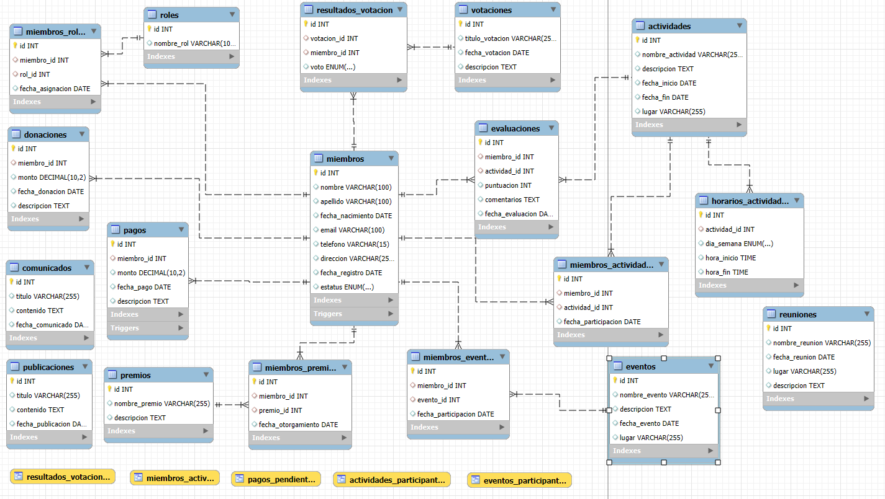

IMAGEN ENTIDAD RELACION DE LAS TABLAS

Situación:
El club se encuentra en un momento de expansión y crecimiento, recibiendo un número creciente de nuevos miembros, organizando más actividades y eventos, y gestionando donaciones y votaciones para la toma de decisiones importantes. Sin embargo, a pesar de este crecimiento, la administración del club sigue dependiendo de procesos manuales, lo que provoca varios problemas:

Errores y demoras en los registros, ya que la información no siempre se actualiza correctamente.
Falta de transparencia, lo que genera confusión en los miembros sobre sus pagos, participaciones, votaciones y donaciones.
Baja participación en actividades y eventos, debido a la falta de un sistema claro para incentivar y rastrear la participación.
Dificultades en la toma de decisiones, ya que las votaciones no siempre se gestionan de manera eficiente.

Objetivo:

El objetivo de implementar esta base de datos es mejorar la administración del club y optimizar la gestión de los miembros, actividades, eventos, votaciones y donaciones mediante una solución automatizada y eficiente. Los objetivos específicos son:
Optimizar la administración: Facilitar la asignación de roles y la gestión de los miembros, incluyendo pagos, votaciones, donaciones y participación en actividades y eventos.
Mejorar la participación: Incrementar la participación de los miembros en actividades y eventos a través de un sistema automatizado de notificaciones y seguimiento de registros.
Aumentar la transparencia: Permitir que los miembros puedan seguir el estado de las votaciones, actividades y donaciones en tiempo real.
Automatizar procesos: Reducir errores humanos y la carga administrativa mediante la automatización de tareas como el registro de pagos, la asignación de roles y el seguimiento de la participación.

Situación Problemática:

El club enfrenta varios problemas operativos debido a la gestión manual de datos, entre ellos:
Falta de seguimiento: Los registros de pagos, donaciones y participación en actividades no siempre son precisos, lo que provoca confusión.
Baja participación: La participación en actividades y eventos es baja, y no existe un sistema claro para incentivar la asistencia.
Dificultades en la toma de decisiones: Las votaciones no se gestionan de manera eficiente, y los resultados no siempre son accesibles para los miembros en tiempo real.

Modelo de Negocio:

El modelo de negocio del club se centra en proporcionar una plataforma organizada y eficiente para la gestión de los miembros y las actividades. Los principales elementos de este modelo incluyen:
1. Servicios que ofrece el club:
Membresía: Los miembros pagan una cuota mensual o anual que les da acceso a actividades, eventos y descuentos.
Actividades y Eventos: El club organiza una variedad de eventos como conferencias, actividades deportivas, cenas y torneos.
Votaciones: Los miembros tienen la oportunidad de votar en decisiones importantes del club, como la elección de roles y la selección de actividades.
Donaciones: El club recibe donaciones tanto de sus miembros como de terceros interesados en apoyar sus proyectos.

2. Fuentes de ingreso:
Cuotas de membresía: Los miembros pagan una cuota periódica (mensual o anual) para ser parte del club.
Donaciones: El club fomenta las donaciones de miembros o de terceros para apoyar las actividades y proyectos.
Eventos pagos: Algunos eventos tienen un costo de participación, generando ingresos adicionales.
Patrocinios: El club busca patrocinadores para eventos especiales, creando alianzas estratégicas con empresas.

3. Modelo de operación:
Administración centralizada: Los administradores gestionan la base de datos, asignan roles, crean eventos, gestionan votaciones y donaciones, y siguen la participación de los miembros.
Plataforma digital: El club ofrece una plataforma en línea donde los miembros pueden consultar actividades, votar en eventos y hacer pagos.
Participación activa: Mediante incentivos como premios y reconocimiento público, se fomenta una mayor participación en las actividades, fortaleciendo la comunidad.

4. Propuesta de valor:
Eficiencia en la gestión: La automatización de procesos mejora la eficiencia y reduce errores humanos, optimizando la administración del club.
Transparencia: Los miembros pueden seguir el estado de votaciones, actividades y resultados en tiempo real, lo que aumenta la confianza.
Comunidad activa: Al incentivar la participación, se crea una comunidad más unida y activa.
Acceso exclusivo: Los miembros tienen acceso a eventos exclusivos, descuentos y contenido especial como beneficios de su membresía.
Solución Propuesta: Base de Datos para Gestión del Club

Para resolver las problemáticas planteadas y cumplir con los objetivos del club, se propone el diseño e implementación de una base de datos centralizada que permita automatizar y gestionar todos los procesos de manera eficiente. Esta base de datos incluirá las siguientes funcionalidades:

1. Gestión de Miembros:
Registro de miembros: Información personal, estado de la membresía, pagos realizados, etc.
Roles y permisos: Asignación de roles y responsabilidades (administradores, miembros, organizadores, etc.).
Historial de pagos: Registro de pagos mensuales/anuales y pagos pendientes.

2. Actividades y Eventos:
Registro de actividades: Detalles de las actividades programadas (tipo de actividad, fecha, hora, lugar, etc.).
Participación en actividades: Seguimiento de la participación de los miembros en cada actividad.
Eventos especiales: Gestión de eventos pagos y gratuitos.

3. Votaciones:
Gestión de votaciones: Creación y seguimiento de votaciones internas, como elecciones de roles y decisiones clave.
Resultados en tiempo real: Visualización de los resultados de las votaciones en tiempo real para los miembros.

4. Donaciones:
Registro de donaciones: Control y seguimiento de las donaciones recibidas, tanto de miembros como de terceros.
Agradecimientos: Automatización del proceso de agradecimiento a los donantes y transparencia sobre el uso de los fondos.

5. Comunicaciones:
Notificaciones automáticas: Sistema de notificaciones por correo electrónico o mensaje dentro de la plataforma para recordar eventos, votaciones, y pagos pendientes.
Foros y mensajes: Herramienta para mejorar la comunicación interna entre los miembros y los administradores.
Beneficios Esperados:
Reducción de errores humanos: Automatización de procesos como registros de pagos, asignación de roles y participación en actividades.
Mayor eficiencia administrativa: Los administradores pueden gestionar todas las operaciones del club desde una plataforma centralizada.
Mejora de la participación: A través de incentivos y notificaciones automatizadas, los miembros estarán más comprometidos y activos en las actividades.
Transparencia: Los miembros tendrán acceso a información actualizada sobre actividades, votaciones, donaciones y otros aspectos importantes.
Crecimiento sostenido: Con una gestión más eficiente, el club podrá manejar su crecimiento de manera más efectiva y profesional.

Conclusión:
La implementación de esta base de datos permitirá al club gestionar sus operaciones de manera mucho más eficiente, reduciendo errores y cargas administrativas. Al automatizar procesos clave, se fomentará una mayor participación de los miembros, lo que contribuirá al crecimiento y la sostenibilidad del club. Además, la transparencia proporcionada por la plataforma aumentará la confianza de los miembros, creando un ambiente más colaborativo y activo.

